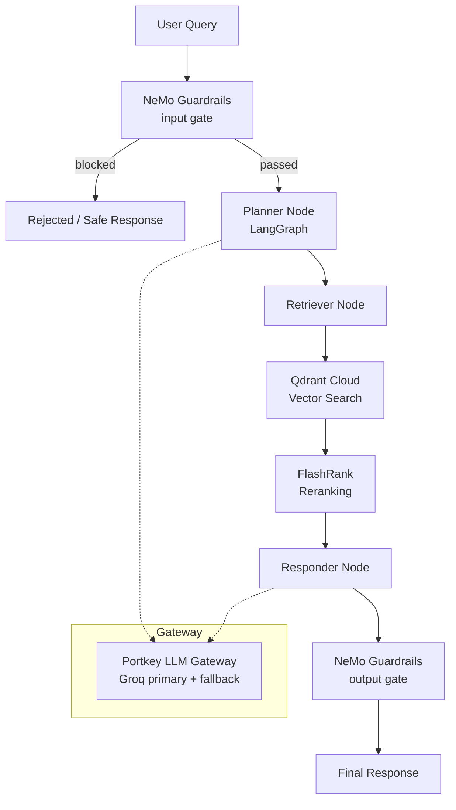

# 🧠 KnowledgeMesh

**Enterprise Agentic RAG platform** built with LangGraph, Qdrant, Gemini Embeddings, FlashRank reranking, Portkey LLM routing, and NeMo Guardrails — for secure, grounded AI knowledge retrieval.

KnowledgeMesh distinguishes **"True Data" vs "Noisy Data"** through semantic re-ranking and history-aware planning, giving enterprises a RAG pipeline that stays grounded, traceable, and resistant to prompt injection — not just a wrapper around a vector search call.

---

## ✨ Key Features

- **LangGraph agentic reasoning** — multi-step planning (Planner → Retriever → Responder) with conversation memory, not a single-shot RAG call
- **NeMo Guardrails** — gates off-topic, jailbreak, and injection inputs *before* retrieval ever runs
- **Portkey LLM Gateway** — routes all LLM calls with automatic fallback between primary and backup Groq keys
- **Qdrant Cloud + FlashRank** — vector search paired with local semantic reranking to separate true signal from noise
- **Gemini embeddings** — `gemini-embedding-2-preview` (3072-dim) via `langchain-google-genai`
- **Local document parsing** — PDF, HTML, TXT, DOCX, PPTX parsed locally with no external OCR dependency
- **Full observability** — Pydantic Logfire + LangSmith trace nesting across every agent node
- **RAGAS eval suite** — 6-metric evaluation pipeline with a dedicated Streamlit demo app

---

## 🏗️ Architecture



**Flow:** Query enters through the Guardrails input gate → Planner node plans multi-step retrieval → Retriever queries Qdrant → FlashRank reranks results to surface true signal over noise → Responder generates a grounded answer via the Portkey-routed LLM → Guardrails output gate validates the response → final answer returned. Every node emits Logfire/LangSmith spans for full trace visibility.

---

## 🧩 Tech Stack

| Layer | Tool |
|---|---|
| Agent orchestration | [LangGraph](https://github.com/langchain-ai/langgraph) |
| LLM gateway / routing | [Portkey](https://portkey.ai/) (Groq primary + fallback key) |
| Guardrails | [NeMo Guardrails](https://github.com/NVIDIA/NeMo-Guardrails) |
| Vector database | [Qdrant Cloud](https://qdrant.tech/) |
| Reranking | [FlashRank](https://github.com/PrithivirajDamodaran/FlashRank) (local) |
| Embeddings | Google `gemini-embedding-2-preview` (3072-dim) via `langchain-google-genai` |
| Document parsing | `pypdf` (PDF) + local HTML/TXT/DOCX/PPTX parsers |
| Observability | Pydantic Logfire + LangSmith |
| Evaluation | [RAGAS](https://github.com/explodinggradients/ragas) (6-metric suite) |
| API | FastAPI |
| Demo UI | Streamlit |

---

## 📂 Project Structure

```
KnowledgeMesh/
├── app/
│   ├── agents/          # Planner / Retriever / Responder nodes (LangGraph)
│   ├── gateway/         # Portkey routing config
│   ├── guardrails/      # NeMo Guardrails config (jailbreak, topic filtering, dialogue mgmt)
│   ├── ingestion/
│   │   ├── chunking/    # Paragraph-based splitter, 1500-char max
│   │   └── loaders/     # pypdf + HTML/TXT/DOCX/PPTX parsers
│   ├── services/
│   │   └── retrieval/   # Gemini embeddings + Qdrant + FlashRank
│   ├── config.py
│   └── main.py          # FastAPI entrypoint — guardrails gate + /query endpoint
├── evals/                # RAGAS suite + 3-tab Streamlit demo
├── ui/                   # Streamlit chat interface with reasoning-step transparency
├── processed_data/       # Auto-generated parsed/chunked JSON per document
├── docs/                 # 11 architectural/operational guides
├── DATA/                 # Sample True vs Noisy datasets
└── requirements.txt
```

---

## 🛡️ Guardrails & Data Quality

- **Input gate** — NeMo Guardrails filters off-topic queries, jailbreak attempts, and prompt injection before retrieval runs
- **True vs Noisy data separation** — semantic reranking (FlashRank) and history-aware planning surface grounded content over noise
- **Output gate** — responses are checked before being returned to the user

---

## 📊 Evaluation

A RAGAS-powered eval suite scores the pipeline across 6 metrics, with results explorable in a dedicated 3-tab Streamlit demo app under `evals/`.

---

## 📄 License

MIT
