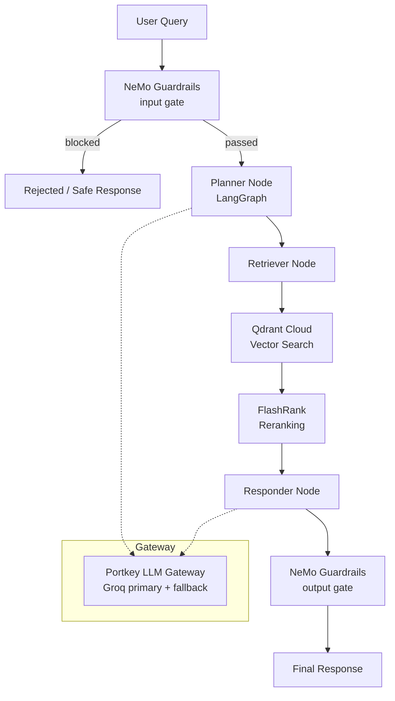
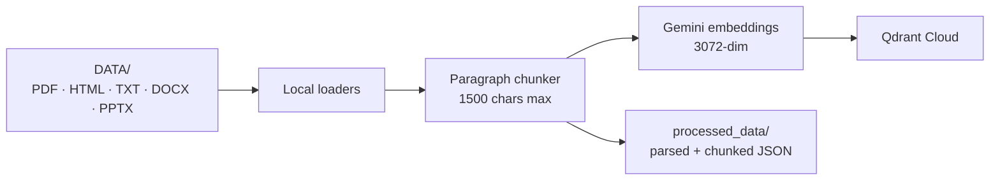

# 🧠 KnowledgeMesh

**Enterprise Agentic RAG platform** built with LangGraph, Qdrant, Gemini Embeddings, FlashRank reranking, Portkey LLM routing, and NeMo Guardrails — for secure, grounded AI knowledge retrieval.

KnowledgeMesh separates **"True Data" from "Noisy Data"** using semantic re-ranking and history-aware planning. The result is a RAG pipeline that stays grounded, traceable, and resistant to prompt injection — not just a wrapper around a vector search call.

🔗 **Live demo:** [knowledgemesh.streamlit.app](https://knowledgemesh-eturkr3qigc6cugmjdvifh.streamlit.app/)

---

## ✨ Key Features

**Reasoning & safety**
- **LangGraph agentic reasoning** — multi-step planning (Planner → Retriever → Responder) with conversation memory, not a single-shot RAG call
- **NeMo Guardrails** — gates off-topic, jailbreak, and injection inputs *before* retrieval runs, and validates responses on the way out
- **Portkey LLM Gateway** — routes every LLM call with automatic fallback between primary and backup Groq keys

**Retrieval**
- **Qdrant Cloud + FlashRank** — vector search paired with local semantic reranking to separate true signal from noise
- **Gemini embeddings** — `gemini-embedding-2-preview` (3072-dim) via `langchain-google-genai`

**Ingestion**
- **Local document parsing** — PDF, HTML, TXT, DOCX, and PPTX parsed locally with no external OCR dependency

**Observability & evaluation**
- **Full tracing** — Pydantic Logfire + LangSmith trace nesting across every agent node
- **RAGAS eval suite** — 6-metric evaluation pipeline with a dedicated Streamlit demo app

---

## 🏗️ Architecture

### Query pipeline


```mermaid
flowchart TD
    A[User Query] --> B[NeMo Guardrails<br/>input gate]
    B -->|blocked| Z[Rejected / Safe Response]
    B -->|passed| C[Planner Node<br/>LangGraph]
    C --> D[Retriever Node]
    D --> E[Qdrant Cloud<br/>Vector Search]
    E --> F[FlashRank<br/>Reranking]
    F --> G[Responder Node]
    G --> H[NeMo Guardrails<br/>output gate]
    H --> I[Final Response]

    subgraph Gateway
    P[Portkey LLM Gateway<br/>Groq primary + fallback]
    end
    C -.-> P
    G -.-> P
```

1. **Input gate** — NeMo Guardrails blocks off-topic, jailbreak, and injection queries
2. **Planner** — plans multi-step retrieval using conversation history
3. **Retriever** — queries Qdrant Cloud with Gemini embeddings
4. **Reranker** — FlashRank reorders results to surface true signal over noise
5. **Responder** — generates a grounded answer through the Portkey-routed LLM
6. **Output gate** — Guardrails validates the response before it is returned

Every node emits Logfire and LangSmith spans for full trace visibility.

### Ingestion pipeline


```mermaid
flowchart LR
    A[DATA/<br/>PDF · HTML · TXT · DOCX · PPTX] --> B[Local loaders]
    B --> C[Paragraph chunker<br/>1500 chars max]
    C --> D[Gemini embeddings<br/>3072-dim]
    D --> E[Qdrant Cloud]
    C --> F[processed_data/<br/>parsed + chunked JSON]
```

---

## 🧩 Tech Stack

| Layer                 | Tool                                                                        |
| --------------------- | --------------------------------------------------------------------------- |
| Agent orchestration   | [LangGraph](https://github.com/langchain-ai/langgraph)                      |
| LLM gateway / routing | [Portkey](https://portkey.ai/) (Groq primary + fallback key)                |
| Guardrails            | [NeMo Guardrails](https://github.com/NVIDIA/NeMo-Guardrails)                |
| Vector database       | [Qdrant Cloud](https://qdrant.tech/)                                        |
| Reranking             | [FlashRank](https://github.com/PrithivirajDamodaran/FlashRank) (local)      |
| Embeddings            | Google `gemini-embedding-2-preview` (3072-dim) via `langchain-google-genai` |
| Document parsing      | `pypdf` (PDF) + local HTML/TXT/DOCX/PPTX parsers                            |
| Observability         | Pydantic Logfire + LangSmith                                                |
| Evaluation            | [RAGAS](https://github.com/explodinggradients/ragas) (6-metric suite)       |
| API                   | FastAPI                                                                     |
| Demo UI               | Streamlit                                                                   |

---

## 📂 Project Structure

```
KnowledgeMesh/
├── app/
│   ├── agents/          # Planner / Retriever / Responder nodes (LangGraph)
│   ├── gateway/         # Portkey routing config
│   ├── guardrails/      # NeMo Guardrails config (jailbreak, topic filtering, dialogue mgmt)
│   ├── ingestion/
│   │   ├── chunking/    # Paragraph-based splitter, 1500-char max
│   │   └── loaders/     # pypdf + HTML/TXT/DOCX/PPTX parsers
│   ├── services/
│   │   └── retrieval/   # Gemini embeddings + Qdrant + FlashRank
│   ├── config.py
│   └── main.py          # FastAPI entrypoint — guardrails gate + /query endpoint
├── evals/               # RAGAS suite + 3-tab Streamlit demo
├── frontend/
├── tests/
├── DATA/                # Sample True vs Noisy datasets
├── processed_data/      # Auto-generated parsed/chunked JSON per document
├── ui.py                # Streamlit chat interface with reasoning-step transparency
├── check_env.py         # Environment / API key check
├── .devcontainer/       # Dev container config
└── requirements.txt
```

---

## 🚀 Quick Start

```bash
# 1. Clone and install
git clone https://github.com/rj1230/KnowledgeMesh.git
cd KnowledgeMesh
pip install -r requirements.txt

# 2. Add your API keys to a .env file (see the table below)

# 3. Verify the environment
python check_env.py

# 4. Start the API
uvicorn app.main:app --reload

# 5. Launch the chat UI
streamlit run ui.py
```

**Services you'll need keys for**

| Service | Used for |
|---|---|
| Portkey + Groq (primary and backup key) | LLM routing and fallback |
| Google AI (Gemini) | Embeddings |
| Qdrant Cloud | Vector storage and search |
| LangSmith and Logfire | Tracing (observability) |

Sample datasets for testing live in `DATA/`, and the RAGAS evaluation suite and its Streamlit demo are in `evals/`.

---

## 🛡️ Guardrails & Data Quality

- **Input gate** — NeMo Guardrails filters off-topic queries, jailbreak attempts, and prompt injection before retrieval runs
- **True vs Noisy data separation** — semantic reranking (FlashRank) and history-aware planning surface grounded content over noise
- **Output gate** — responses are checked before being returned to the user

---

## 📄 License

MIT
