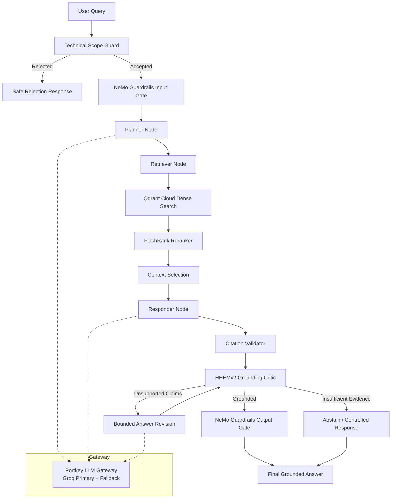
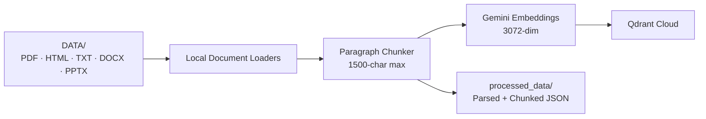

<div align="center">

# 🧠 KnowledgeMesh

### Production-Grade Agentic RAG Platform

**Self-correcting, evidence-grounded enterprise RAG with measurable retrieval quality, citation provenance, safety guardrails, and full observability.**

[](https://www.python.org/)
[](https://fastapi.tiangolo.com/)
[](https://github.com/langchain-ai/langgraph)
[](https://qdrant.tech/)
[](https://streamlit.io/)
[](LICENSE)

🔗 **Live Demo:** [KnowledgeMesh Streamlit App](https://knowledgemesh-e9thzvnbeeghgbeokytqml.streamlit.app/)

</div>

---

## 📌 Overview

**KnowledgeMesh** is a production-oriented Agentic RAG platform designed for secure, grounded, and traceable enterprise knowledge retrieval.

Instead of treating retrieval as a single vector-search call, KnowledgeMesh uses a LangGraph-based multi-stage agent pipeline that plans queries, retrieves candidates, reranks evidence, generates answers, validates citations, evaluates claim-level grounding, and revises or abstains when evidence is insufficient.

The platform is built around one core principle:

> **Do not return an answer unless it can be traced back to valid, document-scoped evidence.**

---

## ✨ Key Capabilities

### 🤖 Agentic Reasoning

- **LangGraph orchestration** for a multi-step reasoning workflow rather than a one-shot RAG request.
- **History-aware query planning** that adapts retrieval to conversational context.
- **Controlled answer revision and abstention** when generated claims are unsupported by retrieved evidence.
- **Reasoning transparency** through an inspectable agent execution trajectory.

### 🔍 Production Retrieval

- **Qdrant Cloud** for scalable dense vector search.
- **Gemini embeddings** for high-dimensional semantic representations.
- **FlashRank** for local semantic reranking.
- **Multi-stage retrieval pipeline:** `Dense@50 → FlashRank@50 → Final@5`.
- **Canonical evidence identity** using `(document_id, chunk_id)` and Qdrant point IDs to prevent cross-document citation collisions.

### 🛡️ Safety & Grounding

- **Fail-closed technical-scope guard** that rejects non-technical, ambiguous, and scope-bypass requests before retrieval.
- **NeMo Guardrails** for input filtering, topic control, jailbreak resistance, and output validation.
- **HHEMv2 claim-level grounding** to detect unsupported generated claims.
- **Citation validation** to ensure every user-facing citation maps to valid retrieved evidence.
- **Bounded revision loop** that corrects unsupported claims using the exact supporting evidence.

### 📈 Evaluation & Reliability

- **Retrieval benchmarking** with Hit@5 and MRR.
- **Claim-level grounding evaluation** using HHEMv2.
- **Citation validity, answer relevance, and execution-trajectory checks.**
- **63 automated tests**, including adversarial, boundary-case, and critical failure-mode regression coverage.
- **RAGAS-based evaluation suite** for broader RAG quality assessment.

### 📡 Observability & Operations

- **FastAPI backend** with health and readiness endpoints.
- **Portkey LLM Gateway** with primary and fallback Groq key routing.
- **Pydantic Logfire and LangSmith tracing** across agent nodes.
- **SQLite audit logging** for query and execution history.
- **Streamlit Cloud-ready UI** with reasoning and pipeline visibility.

---

## 📊 Results

| Evaluation Area | Result |
|---|---:|
| Retrieval benchmark | 70 probes |
| Retrieval pipeline | Dense@50 → FlashRank@50 → Final@5 |
| Overall Hit@5 | **0.857** |
| Dense-dominant evaluation Hit@5 | **0.871** |
| Dense-dominant evaluation MRR | **0.758** |
| Automated tests | **63** |

> Retrieval metrics are measured on the project’s curated technical evaluation benchmark. Grounding, citation validity, relevance, and trajectory checks are part of the automated evaluation and regression suite.

---

## 🏗️ Architecture


```mermaid
flowchart TD
    A[User Query] --> B[Technical Scope Guard]
    B -->|Rejected| Z[Safe Rejection Response]
    B -->|Accepted| C[NeMo Guardrails Input Gate]
    C --> D[Planner Node]
    D --> E[Retriever Node]
    E --> F[Qdrant Cloud Dense Search]
    F --> G[FlashRank Reranker]
    G --> H[Context Selection]
    H --> I[Responder Node]
    I --> J[Citation Validator]
    J --> K[HHEMv2 Grounding Critic]
    K -->|Unsupported Claims| L[Bounded Answer Revision]
    L --> K
    K -->|Grounded| M[NeMo Guardrails Output Gate]
    K -->|Insufficient Evidence| N[Abstain / Controlled Response]
    M --> O[Final Grounded Answer]
    N --> O

    subgraph Gateway
    P[Portkey LLM Gateway<br/>Groq Primary + Fallback]
    end

    D -.-> P
    I -.-> P
    L -.-> P
```

### Query Flow

1. **Technical Scope Guard** rejects non-technical, ambiguous, or scope-bypass requests before retrieval.
2. **NeMo Guardrails** filters jailbreak, injection, and off-topic inputs.
3. **Planner** creates a retrieval strategy using conversation history.
4. **Retriever** queries Qdrant using Gemini embeddings.
5. **FlashRank** reranks retrieved candidates to prioritize relevant evidence.
6. **Responder** generates an answer from the selected context.
7. **Citation Validator** verifies that citations map to valid document-scoped evidence.
8. **HHEMv2 Grounding Critic** detects unsupported atomic claims.
9. **Revision Node** revises unsupported claims using evidence-specific feedback or triggers abstention.
10. **Output Guardrails** validate the final response before returning it to the user.

---

## 📥 Ingestion Pipeline


```mermaid
flowchart LR
    A[DATA/<br/>PDF · HTML · TXT · DOCX · PPTX] --> B[Local Document Loaders]
    B --> C[Paragraph Chunker<br/>1500-char max]
    C --> D[Gemini Embeddings<br/>3072-dim]
    D --> E[Qdrant Cloud]
    C --> F[processed_data/<br/>Parsed + Chunked JSON]
```

- Documents are parsed locally with no external OCR dependency.
- Content is chunked into paragraph-based segments with a maximum length of 1,500 characters.
- Each chunk retains a canonical `(document_id, chunk_id)` identity.
- Embeddings and Qdrant point IDs are linked to the same evidence identity used by citations and grounding checks.

---

## 🧩 Tech Stack

| Layer | Tools |
|---|---|
| Agent orchestration | LangGraph |
| Backend API | FastAPI |
| Vector database | Qdrant Cloud |
| Embeddings | Google Gemini Embeddings, 3072-dim |
| Reranking | FlashRank |
| LLM routing | Portkey LLM Gateway with Groq primary and fallback keys |
| Safety | NeMo Guardrails |
| Grounding evaluation | HHEMv2 |
| Observability | Pydantic Logfire, LangSmith |
| Evaluation | RAGAS, custom retrieval/grounding/citation suite |
| Document parsing | pypdf, HTML, TXT, DOCX, PPTX loaders |
| Audit storage | SQLite |
| UI | Streamlit |

---

## 📂 Project Structure

```text
KnowledgeMesh/
├── app/
│   ├── agents/               # LangGraph planner, retriever, responder, critic, revision nodes
│   ├── gateway/              # Portkey LLM routing configuration
│   ├── guardrails/           # NeMo Guardrails input/output safety configuration
│   ├── ingestion/
│   │   ├── chunking/         # Paragraph-based chunking
│   │   └── loaders/          # PDF, HTML, TXT, DOCX, and PPTX parsers
│   ├── services/
│   │   └── retrieval/        # Gemini embeddings, Qdrant search, FlashRank reranking
│   ├── config.py
│   └── main.py               # FastAPI entrypoint and query endpoint
├── evals/                    # Retrieval, grounding, citation, relevance, and RAGAS evaluation
├── frontend/                 # Frontend assets
├── tests/                    # Automated unit, integration, and regression tests
├── DATA/                     # Sample technical and noisy datasets
├── processed_data/           # Generated parsed and chunked JSON
├── ui.py                     # Streamlit Agentic RAG console
├── check_env.py              # Environment and API-key validation
├── .devcontainer/            # Development container configuration
└── requirements.txt
```

---

## 🚀 Quick Start

### 1. Clone and install

```bash
git clone [https://github.com/rj1230/KnowledgeMesh.git](https://github.com/rj1230/KnowledgeMesh.git)
cd KnowledgeMesh
pip install -r requirements.txt
```

### 2. Configure environment variables

Create a `.env` file in the project root:

```env
# LLM routing
PORTKEY_API_KEY=your_portkey_api_key
GROQ_API_KEY_PRIMARY=your_primary_groq_key
GROQ_API_KEY_BACKUP=your_backup_groq_key

# Embeddings
GOOGLE_API_KEY=your_google_ai_api_key

# Vector database
QDRANT_URL=your_qdrant_cloud_url
QDRANT_API_KEY=your_qdrant_api_key

# Observability
LANGSMITH_API_KEY=your_langsmith_api_key
LOGFIRE_TOKEN=your_logfire_token
```

### 3. Verify the environment

```bash
python check_env.py
```

### 4. Start the FastAPI backend

```bash
uvicorn app.main:app --host 127.0.0.1 --port 8000 --reload
```

### 5. Launch the Streamlit UI

```bash
streamlit run ui.py
```

### 6. Run the evaluation suite

```bash
python -m evals.run_evaluation
```

To save results to a custom file:

```bash
python -m evals.run_evaluation --output evals/results/full_eval.json
```

---

## 🔑 Required Services

| Service | Purpose |
|---|---|
| Portkey + Groq | LLM routing, primary model access, and fallback keys |
| Google AI / Gemini | Embedding generation |
| Qdrant Cloud | Vector storage and retrieval |
| LangSmith | Agent tracing and observability |
| Logfire | Structured application tracing |

---

## 🧪 Evaluation Coverage

KnowledgeMesh evaluates the system across multiple reliability dimensions:

- **Retrieval quality:** Hit@5, MRR, and reranking effectiveness.
- **Grounding:** HHEMv2-based supported versus unsupported claim detection.
- **Citation validity:** Verification that citations resolve to valid document-scoped evidence.
- **Answer relevance:** Whether the final response addresses the user query.
- **Execution trajectory:** Whether the agent follows the expected pipeline behavior.
- **Safety regression:** Adversarial, ambiguous, off-topic, jailbreak, and scope-bypass cases.

---

## 🛡️ Safety Model

KnowledgeMesh uses a defense-in-depth approach:

- **Pre-retrieval scope guard:** Blocks requests outside the platform’s technical knowledge domain.
- **Input guardrails:** Filters prompt injection, jailbreaks, and off-topic requests.
- **Evidence-grounded generation:** Uses only selected retrieved context.
- **Citation validation:** Ensures citations point to valid evidence identities.
- **Claim-level grounding:** Detects unsupported generated claims using HHEMv2.
- **Bounded revision:** Revises unsupported claims using evidence-specific feedback.
- **Abstention:** Avoids answering when evidence is insufficient.
- **Output guardrails:** Performs a final response safety check.

---
